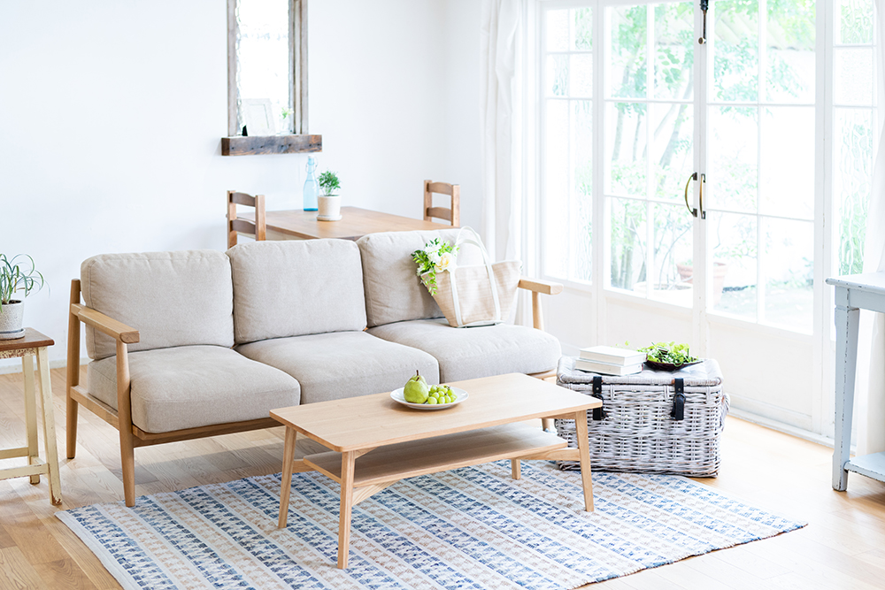
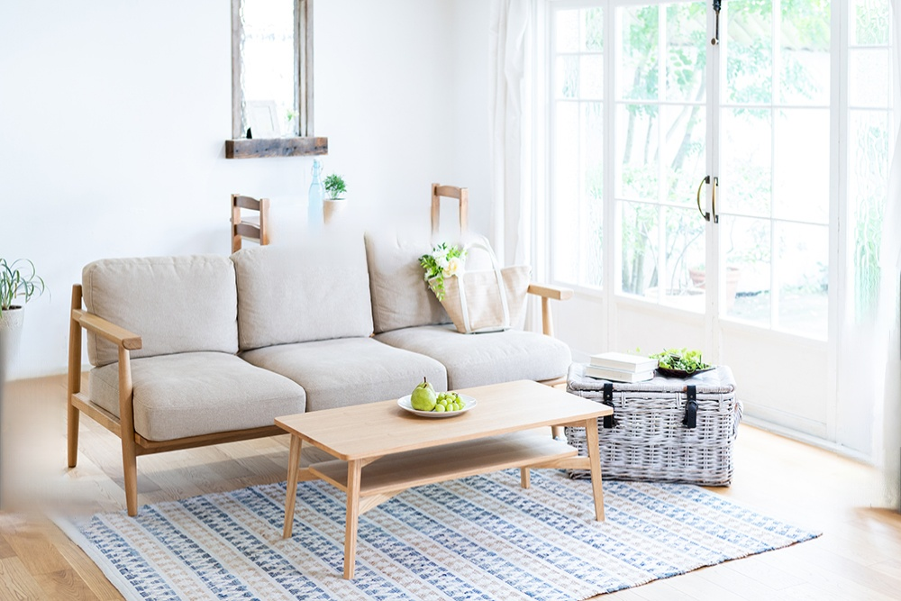
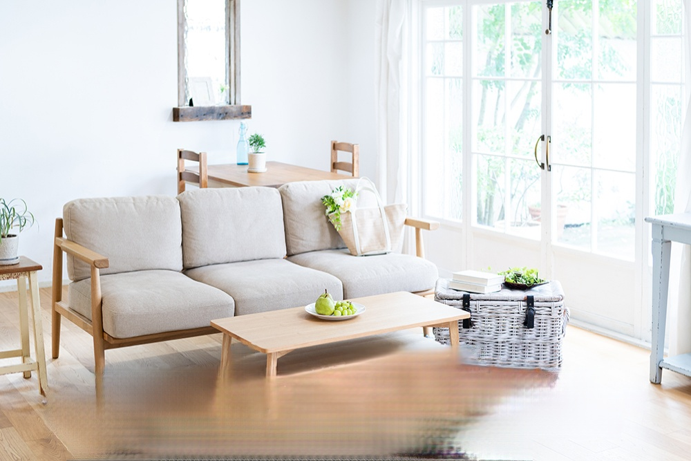
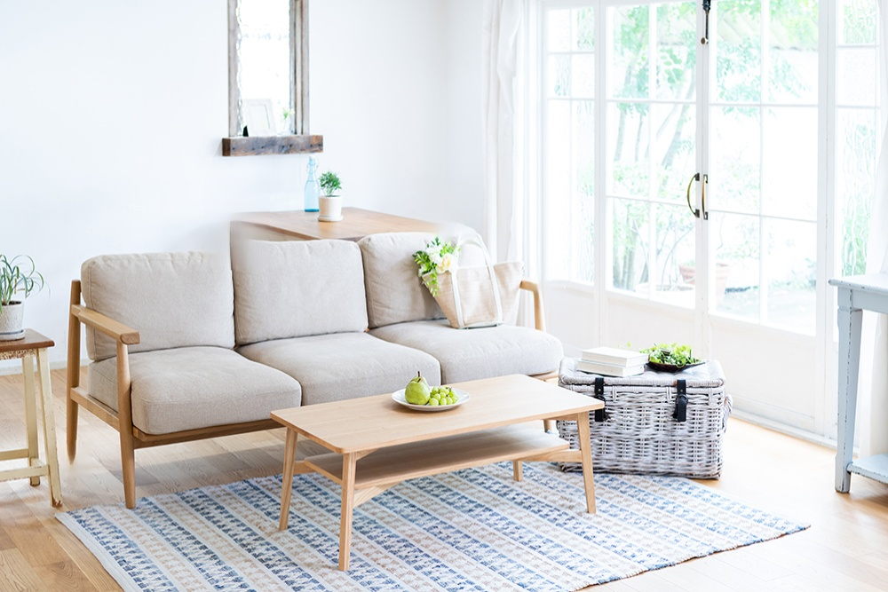

### Summary
oneformerによるマスクセグメントとObject Removalを利用して特定の物体を除去するアプリケーション

### Results
| delete object| before | after |
| :--: | :--: | :--: |
| table |  |  |
| rug |  |  |
| chair |  |  |

### Conclusion
- 小さめのものだったら基本的に消せる
- 椅子の近くとかテーブルの近くとか何かの近くにあるものを消そうとすると違和感が残る

### Related Links
- [propainter](https://github.com/sczhou/ProPainter)

### Related Notebooks
- [propainter](https://colab.research.google.com/drive/1dtQAcAsal75StCplJhFJg-xLHZne_Msa?hl=ja#scrollTo=pQBJzyrSKzBY)
