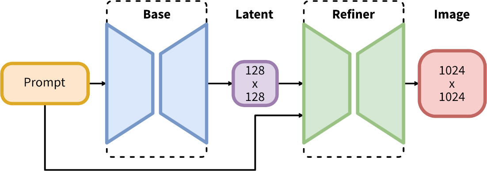
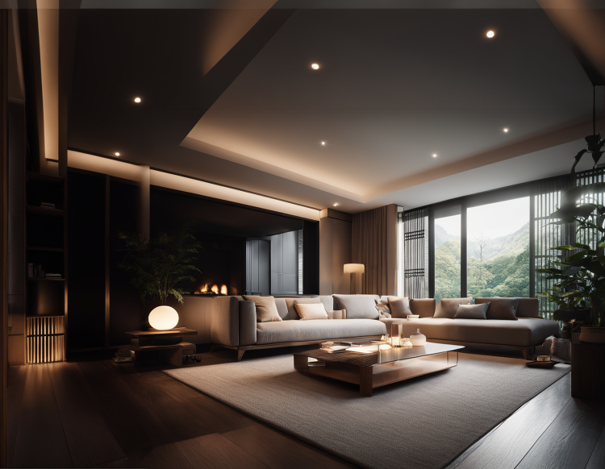

### Summary
stable diffusionとmid jounrneyから着想を得て、内部的にさまざまな最適化と画像の質の向上を行う機構を備えた画像生成アプリケーション

### Keyworkds
- stable diffusion
- mid journey
- optimization

### Architecture

### Results

1. Text to Image Results

2. Inpainting and Outpainting Results

### Conclusion
- 全体生成をしたり、元画像に対してさらに高精細に何かを足したいという要望があれば利用するのが良さそう。

### Related Algorithm
- [stable diffuxion xl](https://huggingface.co/stabilityai/stable-diffusion-xl-base-1.0)
- [stable diffusion xl refiner](https://huggingface.co/stabilityai/stable-diffusion-xl-refiner-1.0)

