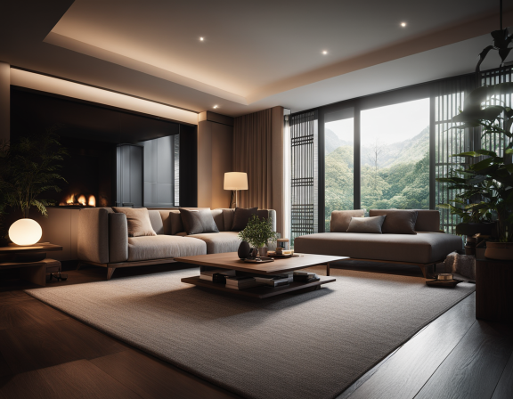

### Summary
- stable diffusionとmid jounrneyから着想を得て、内部的にさまざまな最適化と画像の質の向上を行う機構を備えた画像生成アプリケーション
- text to imageモデル
- 現在Upscale, Inpaint, Outpaintに対応
    - inpaintは最初に指定したプロンプトの主人公的なところしかしてして変更することができなさそう。
- GPUメモリの消費量は10.6GB、CPUの方も10GBくらい

### Examples
- 広告や雑誌の表紙の作成・仕上げ
- プロンプトベースでの依頼から広告イメージや雑誌イメージを共有する際のたたき台としての使用

### Results

### Related Links
- [Fooocus](https://github.com/lllyasviel/Fooocus/tree/main)
- [Fooocus Docs](https://github.com/lllyasviel/Fooocus/discussions/390)

### Related Notebooks