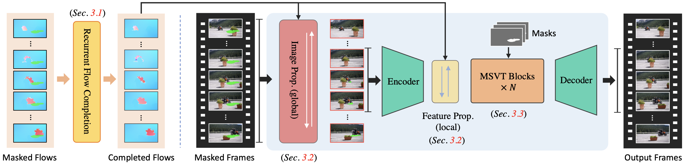

### Summary
- 画像と画像内に映る特定の物体のマスクから画像内部より適切にその特定物体を消去することが可能
- 物体だけでなく文字も消すことが可能

### Keyworkds
- removal
- flow based propagation
- spatiotemporal transformer

### Architecture

### Results

before

https://github.com/softmurata/generative-ai-handsbook/assets/67137475/a88ae0cc-cf24-4e41-962f-6c0f1ab75700

after

https://github.com/softmurata/generative-ai-handsbook/assets/67137475/147c59e7-97af-4a18-94c0-64c3ea0dac6a

### Related Algorithm

