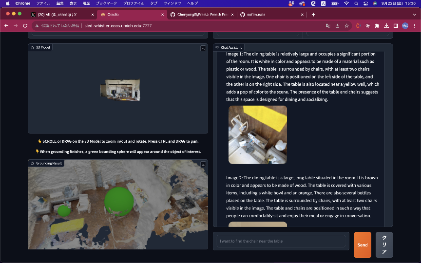

### Data Preparation
- LidarやNerfやphotogramettry、SLAMのようなもので取得してきた点群やメッシュを準備してください。
- 以下のようなものを参考にするといいと思います。
    - scanniverse
    - polycam
    - immersal sdk
    - 3d scanner app
    - nerfstudio
    - instant-ngp
    - meshroom
    - pyslam

### Spec
Blip2とLERFを利用しているのでA10G以上は確定

### Usage Flow
1. [Demo](http://sled-whistler.eecs.umich.edu:7777/)に行きます。
2. 3Dモデルがアップロードされているのでhome_1の方を選択
3. Sendの横にあるpromptの入力欄に部屋の3Dモデルから探したいものを指示します。

```
I want to find chair near the table in this room
```

4. 結果を確認します。左下に今回発見した部分の検出領域が緑色の球体で記されています。

### Results


### Conclusion
- そんなに綺麗じゃない3Dモデルでも適切に検出できている
- 汚いpoint cloudとかを置いておいて、その上の3Dモデルは綺麗なモデルに置き換えた状態でchat3Dを行うと検索体験としては新しいものを提供できそう。

### Related Links
- [chatnerf summary](https://chat-with-nerf.github.io/)
- [nerfstudio](https://zenn.dev/fusic/articles/try-nerfstudio)
- [instant-ngp](https://github.com/NVlabs/instant-ngp)
- [meshroom](https://alicevision.org/)
- [immersal sdk](https://www.mlit.go.jp/plateau/learning/tpc14-2/)
- [scanniverse](https://scaniverse.com/)
- [LERF](https://docs.nerf.studio/en/latest/nerfology/methods/lerf.html)
- [Blip2, Coca](https://blog.shikoan.com/coca-blip2/)