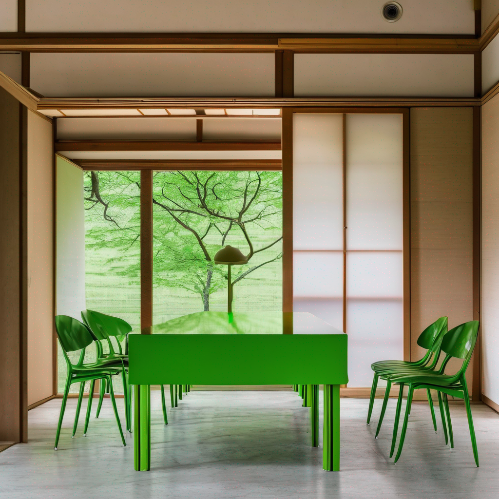

### Data Preparation
- 特に必要なし

### Spec
A10Gで稼働(24GB~32GB)

### Usage Flow
1. [Demo](https://huggingface.co/spaces/songweig/rich-text-to-image)に行きます。
2. negative promptに以下の文字を入れます。
```
poor quality, worst quality, blurr
```
3. text editor内に適切なpromptを入れます。
4. Generateボタンを押します。
5. 推論時間は500秒くらい
6. Resultsにあるようにtext editorで強調したい単語や、色を変更したいobjectの単語を変更して試してみて

### Results
| Prompt | Image |
| :--: | :--: |
| a chair and a table in the living room in japan, tokyo. |  |
| a chair and a <span style="color: green">table</span> in the living room in japan, tokyo | |
| a **chair** and a <span style="color: red">table</span> in the living room in japan, tokyo. |  |

### Conclusion
- 部屋生成に関してはその物体を特定して適切に変化させることができてはいる
- ただその物体の周辺にも影響が及ぶので適切にコントロールするのは難しそう

### Related Links
- [stable diffusion xl](https://huggingface.co/stabilityai/stable-diffusion-xl-base-1.0)
