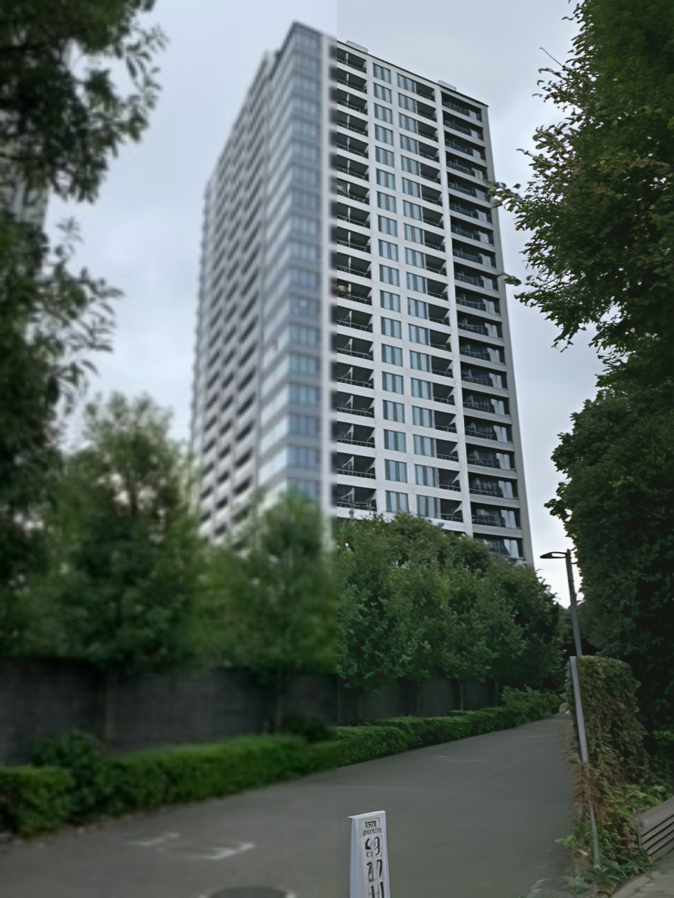

### Data Preparation
- 低解像度の写真を一つ用意してください。

### Spec
A10Gで動作しているので(24GB~32GB)くらいのメモリが必要

### Usage Flow
1. [Demo](https://huggingface.co/spaces/Iceclear/StableSR)にいきます。
2. Inputのところに高解像度化したい画像を入れます。
3. rescaling factorのところを4にしてください。
4. 180~200秒くらいすると結果が出ます。

### Results

### Conclusion
- CodeFormerに比べて色々な対象物に対して高解像度化が強い
- かなり大きなモデルを利用しているために容易に利用することが不可能

### Related Links
- [CodeFormer](http://cedro3.com/ai/codeformer/)