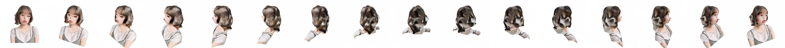

### Data Preparation
- 一つの物体だけが写っている写真を準備してください。

### Spec
A10Gで稼働

### Usage Flow
1. [Demo](https://huggingface.co/spaces/liuyuan-pal/SyncDreamer)に行きます。
2. Input ImageというところにData Preparationで用意した写真をアップロードしてください。Input to Sync Dreamerという欄にInputした画像が表示されるまで待ちましょう。
3. 表示されたらrun generarionというボタンを押してください。
4. 推論時間は60秒ほどです。

### Results

### Conclusion
- アニメに限らず全身画像には強そう
- 人間の上半身とか写っているやつとか対照性が欠け始めると多視点画像の生成が崩れ始める
- 椅子とかの家具に関しては、素材がしっかりしている（脚が細いとか）ものならうまく行きそう

### Related Links